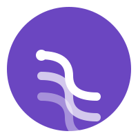

<div align="center">



# Threads

<p>A full-stack social platform with real-time chat, WebRTC video calls, and community spaces.<br/>Built on Next.js 14, a hand-rolled WebSocket server, Redis pub/sub, and MongoDB.</p>

[](https://nextjs.org) [](https://typescriptlang.org) [](https://mongoosejs.com) [](https://redis.io) [](https://webrtc.org) 
[](https://www.apache.org/licenses/LICENSE-2.0)

<p><strong>No Pusher. No Twilio. No Firebase. Every real time primitive is owned.</strong></p>

</div>
---
## Demo

https://github.com/user-attachments/assets/57b5bde2-af99-4c8e-ae8b-750afb0622c8
---

---

## Why build the WebSocket server yourself?

Next.js App Router has no WebSocket support. The standard advice is to reach for a managed service. That's fine until you hit rate limits, vendor pricing, or need to actually understand what's happening inside your app.

This project boots Next.js programmatically inside `server.ts`, shares one HTTP server, and intercepts the `upgrade` event before Next.js ever sees it. `/ws/*` paths go to `ws`. Everything else goes to Next.js. One process, no proxy, no magic.

```ts
server.on("upgrade", (req, socket, head) => {
  if (pathname?.startsWith("/ws/")) {
    wss.handleUpgrade(req, socket, head, ...)
  } else {
    socket.write("HTTP/1.1 404 Not Found\r\n\r\n");
    socket.destroy();
  }
})
```

The tradeoff: you can't deploy this to Vercel or Netlify. You need a persistent process. Railway, Fly, Render, or a raw VM all work fine. That's an acceptable constraint.

---

## Architecture

```
Browser
  │
  ├─ HTTP ──────► Next.js App Router
  │                  ├─ MongoDB  (threads, users, communities, conversations, messages)
  │                  └─ UploadThing (image storage → CDN URLs)
  │
  └─ WebSocket ─► server.ts
                    ├─ /ws/chat/<roomId>/
                    │    └─ Redis pub/sub → two-stage fan-out across sockets
                    └─ /ws/video_call/
                         └─ Signaling relay → WebRTC P2P
```

**Chat uses Redis pub/sub** because the in-memory room registry (`Map<roomId, Set<WebSocket>>`) only works within a single Node process. The fan-out is two-stage: every incoming message is published to Redis, which broadcasts to all Node instances; each instance then fans out to its own local WebSocket connections for that room. Every message is also written to MongoDB with a 30-day TTL index — auto-deleted by the database, no cron needed. Message status (`delivered`, `read`) is also persisted to MongoDB so it survives reconnects.

**Video uses WebRTC** because 1-to-1 calls don't need a media server. The signaling layer relays `call-initiate`, `call-answer`, `ice-candidate`, `ice-restart`, `call-declined`, `call-end`, and `call-unavailable` between two clients, stamping `from: registeredUserId` on every relay. Once the P2P connection is established, the server is completely out of the media path. The tradeoff is that symmetric NAT traversal requires TURN — configured via env vars with a public fallback.

---

## Stack

| Concern | Choice |
|---|---|
| Framework | Next.js 14 (App Router) |
| Auth | Clerk |
| Database | MongoDB + Mongoose |
| Cache / Pub-Sub | Redis (ioredis) |
| Real-time | WebSocket (`ws`), WebRTC |
| File uploads | UploadThing |
| Styling | Tailwind CSS |
| Language | TypeScript throughout |
| Dev environment | Nix flake (optional but recommended) |

---

## Getting started

### Prerequisites

- Node.js 20+
- MongoDB instance (local or Atlas)
- Redis instance (local or managed)
- [Clerk](https://clerk.com) account
- [UploadThing](https://uploadthing.com) account

### Environment variables

```bash
# .env.local

# Clerk
NEXT_PUBLIC_CLERK_PUBLISHABLE_KEY=pk_...
CLERK_SECRET_KEY=sk_...
NEXT_PUBLIC_CLERK_SIGN_IN_URL=/sign-in
NEXT_PUBLIC_CLERK_SIGN_UP_URL=/sign-up
NEXT_PUBLIC_CLERK_AFTER_SIGN_IN_URL=/
NEXT_PUBLIC_CLERK_AFTER_SIGN_UP_URL=/onboarding

# Database
MONGODB_URL=mongodb://127.0.0.1:27017/threads_app

# Cache
REDIS_URL=redis://127.0.0.1:6379

# File uploads
UPLOADTHING_SECRET=sk_live_...
UPLOADTHING_APP_ID=...

# WebRTC TURN (optional — falls back through self-hosted → public STUN/TURN if omitted)
NEXT_PUBLIC_METERED_API_KEY=...
# — or self-hosted TURN —
NEXT_PUBLIC_TURN_HOST=your.turn.server
NEXT_PUBLIC_TURN_USER=username
NEXT_PUBLIC_TURN_CREDENTIAL=password
```

### Run locally

```bash
npm install
npm run dev         # starts server.ts with tsx watch — Next.js + WS on :3000
```

### With Nix (zero-setup option)

The Nix flake auto-starts MongoDB and Redis in Docker, sets all env defaults, and gives you a reproducible shell.

```bash
nix develop         # or: direnv allow  (requires nix-direnv)
npm install
npm run dev
```

To stop the Docker containers:

```bash
cleanup_services
```

### Production

```bash
npm run build
npm start           # NODE_ENV=production tsx server.ts
```

---

## How the chat works

Three things that matter:

**1. Optimistic UI.** The sender sees their message immediately with `status: "sending"`. The server responds with `message_confirmed` carrying the real server ID. The client reconciles via `tempId`.

**2. Exactly-once rendering.** A `Set<string>` of seen message IDs lives in a component ref. History replay and live delivery can race on reconnect — the set deduplicates silently.

**3. Reconnect with history.** The client uses exponential backoff (`1000 * 2^attempt`, capped at 30s). On every new connection (including reconnects), the server replays the last 50 messages from MongoDB before any live events arrive.

Message flow:

```
Client                    Server               Redis
  │── send message ──────► │── save to Mongo ───►│
  │                        │── setex msg:* ─────►│
  │◄── message_confirmed ──│                     │
  │                        │ publish "chat" ──►  │
  │                        │◄─ sub receives ─────│
  │                        │── fan-out to room   │
  │◄─── (other clients) ───│                     │
```

**Message status lifecycle.** `sent` is set when MongoDB write completes. When the recipient's client receives a message, it sends a `delivered` event; when the user views it, it sends a `read` event. Both update MongoDB via `WsMessage.findOneAndUpdate` and fan out to the sender via Redis pub/sub so the sender's UI can show check marks in real time.

Typing indicators (`typing`) are the only truly ephemeral event — published to Redis, never written to MongoDB.

---

## How the video call works

The signaling server holds a `Map<userId, WebSocket>`. Every browser registers its Clerk user ID on connect. Messages are relayed directly to the target user ID — the server stamps `from: registeredUserId` on each relay but does not inspect the WebRTC SDP or ICE payloads themselves.

**Full signaling protocol:**

| Message type | Direction | Purpose |
|---|---|---|
| `register` | client → server | Associate Clerk userId with this socket |
| `registered` | server → client | Acknowledge registration |
| `call-initiate` | caller → server → callee | Start a call, carries offer SDP |
| `call-answer` | callee → server → caller | Accept, carries answer SDP |
| `ice-candidate` | either → server → other | Relay ICE candidate |
| `ice-restart` | either → server → other | Trigger ICE restart after failure |
| `call-declined` | callee → server → caller | Reject incoming call |
| `call-end` | either → server → other | Hang up |
| `call-unavailable` | server → caller | Target socket not found or not open |

```
Caller                Server (relay)               Callee
  │── register ──────────► │ ◄──────── register ───────│
  │── call-initiate ──────►│ ──── call-initiate ──────►│
  │                        │ ◄─── call-answer ─────────│
  │◄─── call-answer ───────│                           │
  │── ice-candidate ──────►│ ──── ice-candidate ──────►│
  │                        │                           │
  │            [P2P media — server is out]             │
```

ICE failure triggers automatic ICE restart (up to 2 attempts before teardown). A 5-second timer also triggers restart if the connection stays in `disconnected` state. Camera acquisition retries 3 times with 500ms backoff to handle the device-busy race that happens on rapid tab focus. If the camera is unavailable, it degrades to audio-only rather than blocking the call.

TURN server priority: Metered API → self-hosted → static public fallback. ICE servers are fetched once, cached at the module level for the entire session.

---

## Feed visibility

The home feed is not global. `fetchPost` resolves the current user's joined community IDs and applies:

```js
{
  parentId: { $in: [null, undefined] },    // top-level only
  $or: [
    { community: null },                   // public posts
    { community: { $in: joinedIds } },     // posts in joined communities
  ]
}
```

Users with no memberships see only public posts. Community content is gated — that's the point of communities.

---

## Project structure

```
.
├── server.ts                        # HTTP + WebSocket server entry point
├── app/
│   ├── api/                         # Webhooks (Clerk) & UploadThing core
│   ├── (auth)/                      # sign-in, sign-up, onboarding
│   └── (root)/                      # authenticated routes
│       ├── page.tsx                 # home feed
│       ├── create-thread/page.tsx   # create new thread
│       ├── thread/[id]/             # thread detail + replies
│       ├── thread-chat/[id]/        # legacy direct chat route
│       ├── profile/[id]/            # user profile
│       ├── communities/             # list, detail, create
│       │   ├── page.tsx
│       │   ├── create/page.tsx
│       │   └── [id]/page.tsx
│       ├── messages/                # conversation list + chat window
│       │   ├── page.tsx
│       │   └── [id]/page.tsx
│       ├── search/page.tsx
│       └── activity/page.tsx
├── components/
│   ├── forms/                       # PostThread, Comment, ThreadChat, etc.
│   ├── carde/                       # ThreadCard, UserCard, CommunityCard, etc.
│   ├── shared/                      # TopBar, LeftSideBar, RightSideBar, etc.
│   └── video-call/                  # VideoCallOverlay, CallButton, etc.
├── hook/
│   └── useVideoCall.ts              # all WebRTC + signaling state
└── lib/
    ├── actions/                     # server actions (thread, user, community, etc.)
    ├── models/                      # Mongoose schemas
    ├── validation/                  # Zod schemas
    ├── mongoose.ts                  # MongoDB connection setup
    └── uploadthings.ts              # UploadThing configuration
```

> **Note on join/leave actions:** Two implementations exist side by side — `community.action.ts` handles MongoDB only, `membership.action.ts` additionally syncs with Clerk organizations. `JoinLeaveButton` uses the former; `JoinCommunityButton` uses the latter. Consolidation is a known TODO.

---

## Data models

**User** — Clerk `id`, `username`, `name`, `image`, `bio`, `onboarded`, refs to threads and communities.

**Thread** — `text`, `author`, `community` (null = public), `parentId` (null = top-level), `children`, `images` (UploadThing CDN URLs — up to 4 per post).

**Community** — unique `username` slug, `name`, `image`, `bio`, `createdBy`, `members[]`, `threads[]`. Creator is always a member and cannot leave — only delete.

**Conversation** — `participants: [ObjectId, ObjectId]`, `lastMessage`, `lastMessageAt`. Exists only for the messages list preview. The two-participant constraint is enforced at query time in `getOrCreateConversation` (`$size: 2`), not at the schema level.

**Message** — defined in `server.ts` (not in `lib/models/`), collection `"messages"`. Fields: `id`, `sender`, `senderName`, `content`, `room_id`, `timestamp`, `status` (`sent` | `delivered` | `read`), `expiresAt`. Two indexes: `{ room_id, timestamp }` for history queries, `{ expiresAt }` TTL for auto-expiry after 30 days.

---

## Deployment

This is a stateful Node.js process. It does not run on serverless platforms.

**Works on:** Railway, Fly.io, Render, any VM.

**Multi-instance:** Redis pub/sub handles chat fan-out correctly across instances — each instance subscribes to the `"chat"` channel and fans out to its own local WebSocket connections. Video signaling (`videoSockets` map) is in-memory per instance — you need sticky sessions or consistent hash routing for signaling to reach the right process. For most use cases a single instance is sufficient.

**Message expiry:** MongoDB auto-deletes messages after 30 days via the TTL index on `expiresAt`. No background worker needed.

---

## License

Copyright 2026 Haider Khan

Licensed under the Apache License, Version 2.0 (the "License");
you may not use this file except in compliance with the License.
You may obtain a copy of the License at

    http://www.apache.org/licenses/LICENSE-2.0

Unless required by applicable law or agreed to in writing, software
distributed under the License is distributed on an "AS IS" BASIS,
WITHOUT WARRANTIES OR CONDITIONS OF ANY KIND, either express or implied.
See the License for the specific language governing permissions and
limitations under the License.
